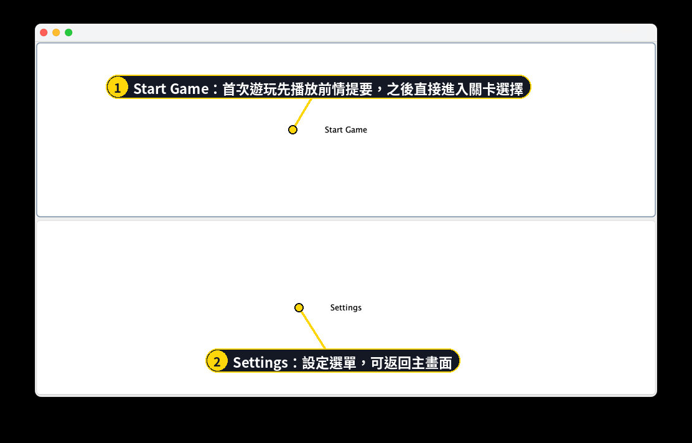
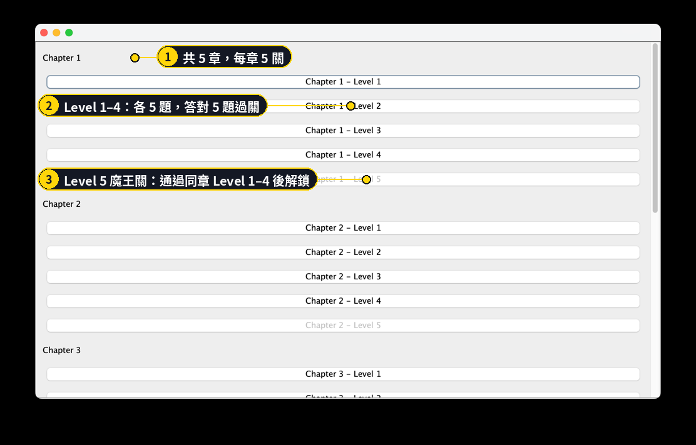
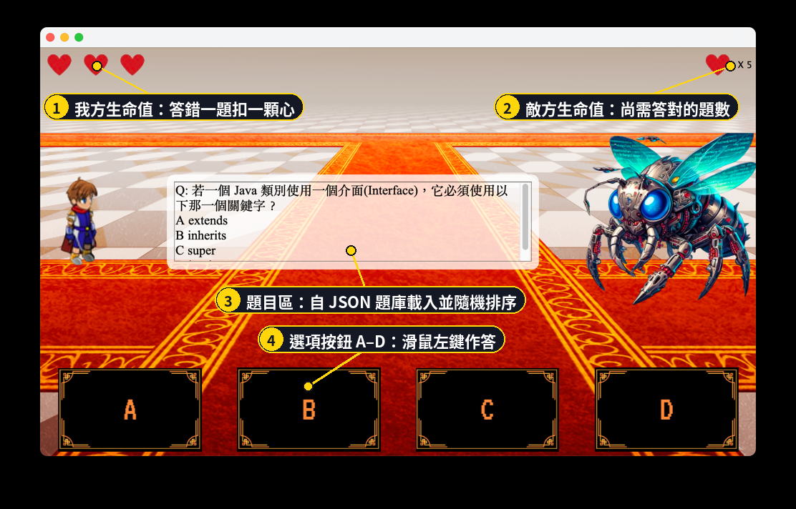
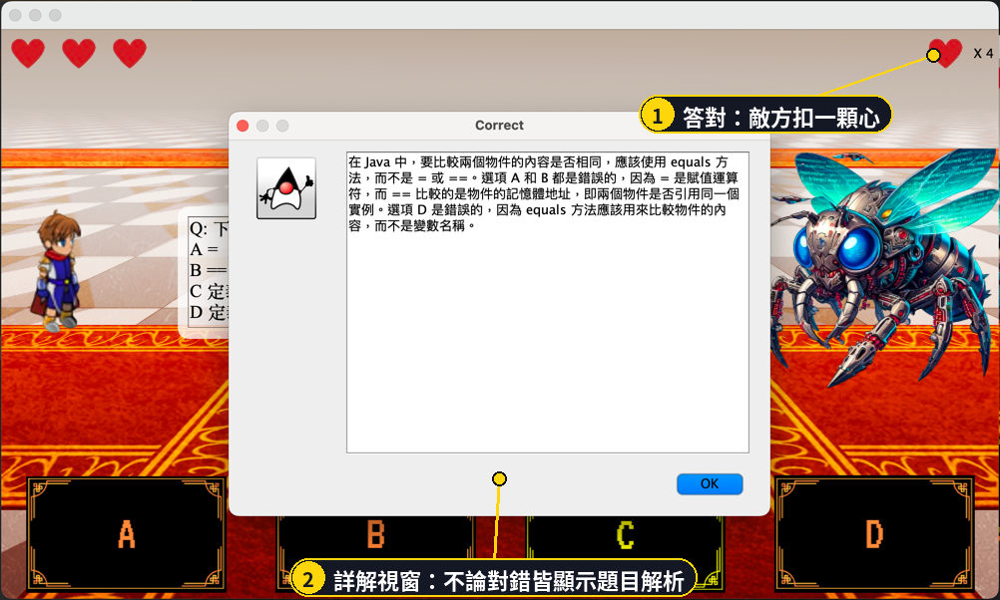
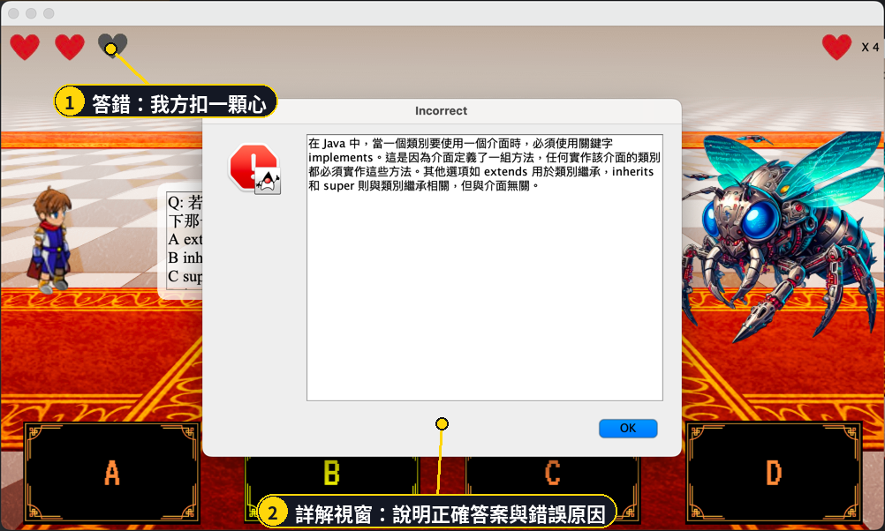
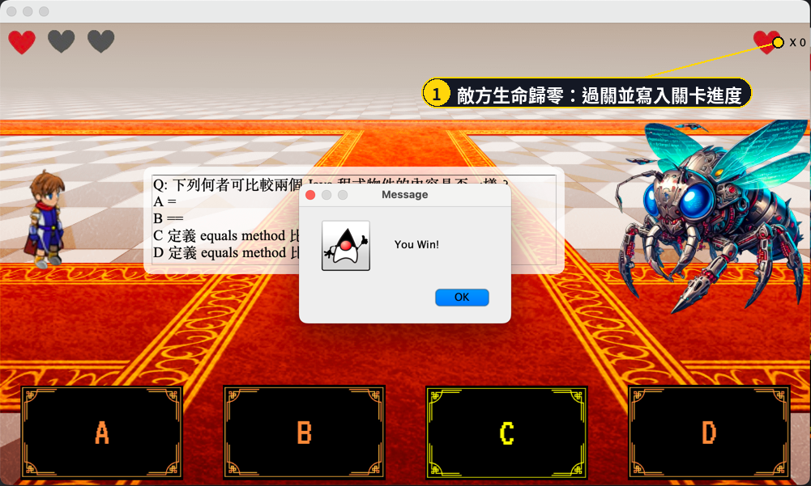
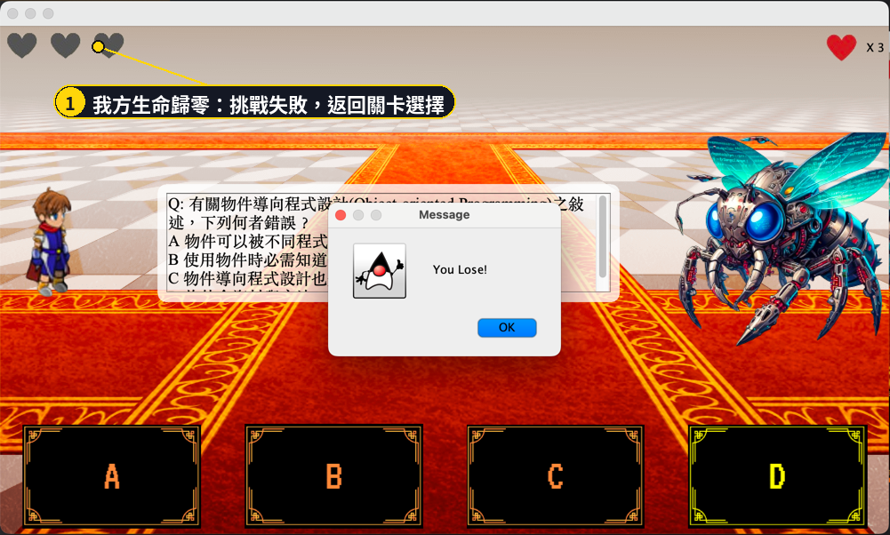
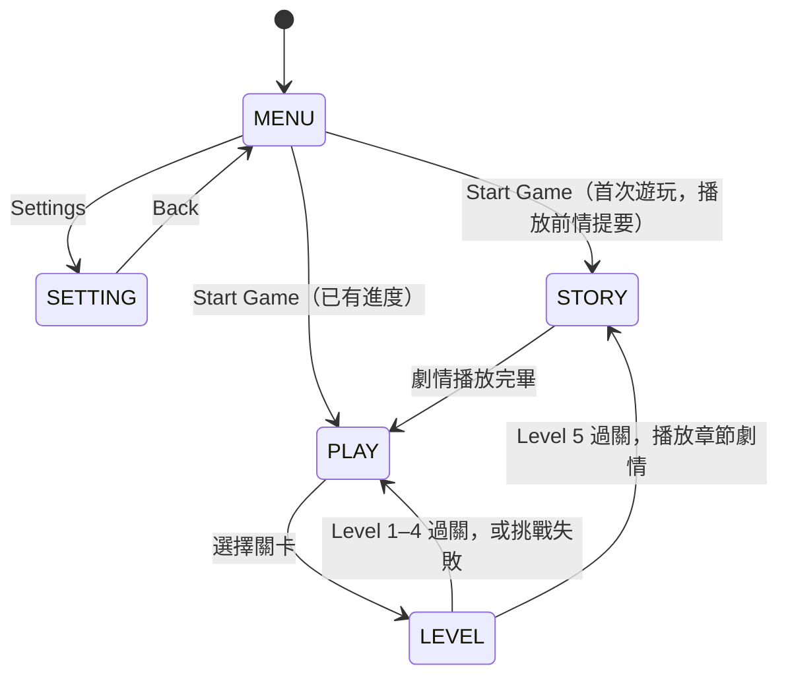
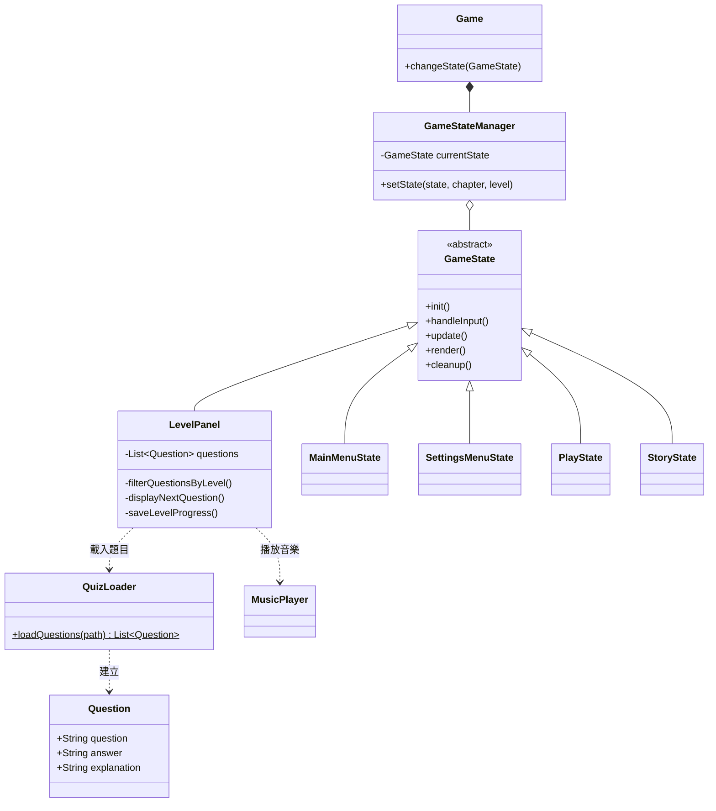

<p align="center">
  
</p>

# 問答式戰鬥 RPG：以狀態模式實作的 Java 桌面遊戲

**Program Design II — A Quiz-Battle RPG Built on the State Pattern**

> 國立成功大學資訊工程學系「程式設計（二）」期末專案（2024 年春季）｜三人團隊
> Java 17 · Swing · Gradle · Jackson / Gson · JLayer

《PROGRAM DESIGN II》是一款操作極簡的問答式戰鬥 RPG。

故事發生在一個被稱作「國立成功大學」的幻想世界。在這裡，被選中的人將被授予「Java 大法」，獲得物件導向之力。你將扮演一位名為「大學生」的神秘角色，在旅途中邂逅性格各異、能力獨特的同伴，和他們一起擊敗強敵、找回失散的學分，並逐步揭開「程式設計二」的真相。

你唯一的武器，是腦中的 Java 觀念。答對，敵人失去一顆心；答錯，換你失血。五個章節、二十五道關卡、一百道題目，每一章的盡頭都有魔王等著你。不論答對或答錯，每一題都附上詳解，所以打完這場仗，期末考也順便複習完了。

準備好了嗎？點擊滑鼠左鍵，開始你的旅程。

---

## 目錄

- [遊戲畫面](#遊戲畫面)
- [系統設計](#系統設計)
- [題庫系統](#題庫系統)
- [劇情系統](#劇情系統)
- [分工](#分工)
- [建置與執行](#建置與執行)
- [專案結構](#專案結構)
- [已知限制](#已知限制)

---

## 遊戲畫面

以下各圖的編號標註說明該畫面的功能，圖下文字補充對應的規則。

### 1. 主選單

<p align="center"></p>

> **說明**　程式啟動後進入主選單。按下 **Start Game** 時，系統會檢查關卡進度檔：若尚無任何紀錄，視為首次遊玩，先播放前情提要再進入關卡選擇；否則直接進入關卡選擇。

### 2. 關卡選擇

<p align="center"></p>

> **說明**　全遊戲共 5 個 Chapter，每個 Chapter 有 5 個 Level。Level 5 為該章的魔王關，按鈕預設為灰色，須通過同章的 Level 1–4 才能進入。

### 3. 戰鬥

<p align="center"></p>

> **說明**　畫面上方為雙方生命值，中央為題目，下方為 A–D 四個選項。題目由該章的題庫載入後隨機排序。
>
> | 關卡 | 題目來源 | 過關條件 | 失敗條件 |
> | --- | --- | --- | --- |
> | Level 1–4 | 該章題庫各取 5 題 | 答對 5 題 | 答錯 3 題 |
> | Level 5（魔王關） | 該章全部 20 題 | 答對 15 題 | 答錯 5 題 |

### 4. 作答回饋

<table>
<tr>
<td width="50%"></td>
<td width="50%"></td>
</tr>
<tr>
<td align="center"><b>答對</b>：敵方扣一顆心</td>
<td align="center"><b>答錯</b>：我方扣一顆心</td>
</tr>
</table>

> **說明**　不論答對或答錯，系統都會彈出詳解視窗，說明正確答案與各選項錯誤的原因。這是本遊戲「邊玩邊複習」的核心設計。

### 5. 過關與失敗

<table>
<tr>
<td width="50%"></td>
<td width="50%"></td>
</tr>
<tr>
<td align="center"><b>過關</b>：寫入關卡進度</td>
<td align="center"><b>失敗</b>：返回關卡選擇</td>
</tr>
</table>

> **說明**　過關後進度會寫入 `level_progress.json`。通過魔王關（Level 5）後，系統會播放該章的劇情，再回到關卡選擇。

---

## 系統設計

本專案的目的是把課堂所學的物件導向設計落實在一個完整的應用程式上，架構上有三項重點：

1. 以狀態模式（State Pattern）管理主選單、關卡選擇、戰鬥、劇情等畫面的切換；
2. 題庫與劇情皆以外部 JSON 描述，新增題目或章節不需修改程式；
3. 關卡進度寫入本機檔案，重新開啟遊戲後可接續遊玩。

### 狀態模式

遊戲的每個畫面是一個「狀態」。所有狀態繼承抽象類別 `GameState`，實作相同的五個方法；`GameStateManager` 持有目前的狀態，並負責切換。切換時先呼叫舊狀態的 `cleanup()` 釋放資源，再建立新狀態並呼叫 `init()`，最後由 `Game`（`JFrame`）換上新狀態的面板。

```java
public abstract class GameState {
    public abstract void init();
    public abstract void handleInput();
    public abstract void update();
    public abstract void render();
    public abstract void cleanup();
}
```

這樣的設計使各畫面的邏輯彼此獨立：新增一個畫面只需新增一個 `GameState` 子類別，並在 `GameStateManager` 登記，不必更動其他畫面。

### 狀態轉移



| 狀態常數 | 類別 | 職責 |
| --- | --- | --- |
| `MENU` | `MainMenuState` | 主選單；判斷是否為首次遊玩 |
| `SETTING` | `SettingsMenuState` | 設定選單 |
| `PLAY` | `PlayState` | 關卡選擇；讀取進度並控制魔王關的解鎖 |
| `LEVEL` | `LevelPanel` | 戰鬥；出題、判定對錯、計算生命值、儲存進度 |
| `STORY` | `StoryState` | 劇情播放 |

### 類別關係

下圖僅列出核心類別。完整的類別圖見 [`doc/ClassDiagram.png`](doc/ClassDiagram.png)。



---

## 題庫系統

題庫與程式分離，每個章節對應一個 JSON 檔（`assets/question/question_1.json` 至 `question_5.json`），各 20 題，共 100 題。每一題包含題目、正確答案與詳解三個欄位：

```json
{
  "question": "Q: 若一個 Java 類別使用一個介面(Interface)，它必須使用以下那一個關鍵字？\nA extends\nB inherits\nC super\nD implements",
  "answer": "D",
  "explanation": "在 Java 中，當一個類別要使用一個介面時，必須使用關鍵字 implements……"
}
```

載入流程如下：

1. `QuizLoader.loadQuestions()` 以 Jackson 的 `ObjectMapper` 將 JSON 反序列化為 `List<Question>`；
2. `LevelPanel` 依關卡編號取出對應區段：Level 1–4 各取 5 題，Level 5 取該章全部 20 題；
3. 以 `Collections.shuffle()` 隨機排序後依序出題。

由於題目資料與程式邏輯分離，擴充題庫只需編輯 JSON 檔，不需重新編譯。

---

## 劇情系統

劇情以逐頁圖片呈現，玩家點擊滑鼠左鍵換頁。各章的圖片資料夾、頁數與副檔名記錄在 `assets/chapter/chapters.json`：

```json
[
  { "path": "assets/chapter/PD2-previou", "count": 24,  "type": "png" },
  { "path": "assets/chapter/PD2-s1",      "count": 197, "type": "png" }
]
```

`StoryState` 讀取這份設定後，依序載入 `path/1.type`、`path/2.type`……直到最後一頁，再通知 `GameStateManager` 切回關卡選擇。前情提要加上五個章節，共 942 頁劇情畫面。

---

## 分工

| 成員 | 負責項目 |
| --- | --- |
| **部政佑** [@pukyle](https://github.com/pukyle) | 劇情系統與各章劇情畫面製作、整體 UI 設計、題庫系統 |
| 江婕瀅 [@Jesse-Jumbo](https://github.com/Jesse-Jumbo/) | <!-- TODO：請確認 --> 遊戲狀態架構整合、Gradle 建置、音樂播放 |
| 黃若慈 [@huang-rose](https://github.com/huang-rose) | <!-- TODO：請確認 --> 劇情內容編修、錯誤修正 |

---

## 建置與執行

**環境需求**：JDK 17 以上。專案內含 Gradle Wrapper，不需另外安裝 Gradle。

```sh
git clone https://github.com/pukyle/program-design-II.git
cd program-design-II
./gradlew clean build
./gradlew run
```

Windows 請將 `./gradlew` 改為 `gradlew.bat`。所有操作皆以滑鼠左鍵完成。

**相依套件**

| 套件 | 用途 |
| --- | --- |
| Jackson Databind 2.13.0 | 題庫與章節設定的 JSON 反序列化 |
| Gson 2.8.8 | 關卡進度的讀寫 |
| JLayer 1.0.1 | 播放 MP3 背景音樂 |
| JUnit 4.13.2 | 測試 |

---

## 專案結構

```
program-design-II/
├── build.gradle
├── doc/
│   ├── ClassDiagram.png          完整類別圖
│   └── readme/                   本文件使用的圖片
└── src/main/
    ├── java/
    │   ├── Game.java             程式進入點（JFrame）
    │   ├── GameStateManager.java 狀態切換
    │   ├── GameState.java        狀態的抽象類別
    │   ├── MainMenuState.java    主選單
    │   ├── SettingsMenuState.java 設定選單
    │   ├── PlayState.java        關卡選擇
    │   ├── LevelPanel.java       戰鬥
    │   ├── StoryState.java       劇情播放
    │   ├── QuizLoader.java       題庫載入
    │   └── MusicPlayer.java      音樂播放
    └── resources/assets/
        ├── question/             題庫 JSON（每章一檔）
        ├── chapter/              劇情圖片與 chapters.json
        ├── image/                角色、背景、按鈕圖片
        └── sound/                背景音樂
```

---

## 已知限制

- 關卡進度檔 `level_progress.json` 以相對路徑存放於執行目錄，從不同目錄啟動會被視為新的進度。
- 設定選單目前僅提供返回主選單的功能。
- 題目依固定區段分配至 Level 1–4，同一關卡的題目組合不變，僅順序隨機。
- 劇情圖片逐頁以完整圖檔儲存，資源檔體積較大。
